# SAPA PNJ (Sarana Pengguna Aplikasi Politeknik Negeri Jakarta)

SAPA PNJ is a specialized social media and communication platform designed exclusively for the Politeknik Negeri Jakarta (PNJ) community.

## Meaning of the Name

Sarana Pengguna Aplikasi: Refers to its primary function as a digital tool or container designed for use by PNJ community members (students, lecturers, staff). It emphasizes that this platform is the application infrastructure for its users.

Politeknik Negeri Jakarta (PNJ): Affirms that this application focuses exclusively on the PNJ academic environment.
Overall, SAPA PNJ serves as a medium to facilitate communication, information sharing, and real-time social interaction among all users in the Politeknik Negeri Jakarta campus environment.

## Project Overview
A Flutter-based social platform for the PNJ community. Backed by Firebase for authentication, Firestore, and security rules. Built with a light-first UI.

## Core Features

- Authentication: Firebase Authentication (login, register, password reset), persistent sessions, and optional email verification.
- Real-time Interaction: Real-time Firestore backend with full CRUD for posts and replies.
- Social Features: Like/Unlike, Repost, Follow/Unfollow interactions.
- Feed: Live feed sorted by timestamp.
- User Profiles: Profiles with bio, name, NIM, email, and navigation to other profiles.
- Customization: Light/Dark theme toggle.
- Account Management: Profile editing, password change, logout, delete account, and change profile picture.
- AI Assistent: Real Gemini Based Backended AI Assistant integrated
- Search: Search for posts, and users

## Screenshots
### Landing & Auth
| Landing | Login | Register |
|--------|--------|----------|
| 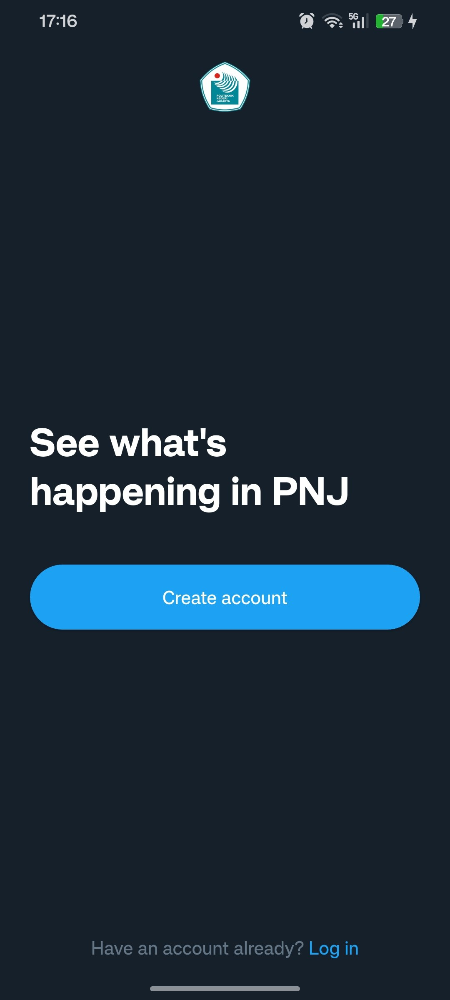 | 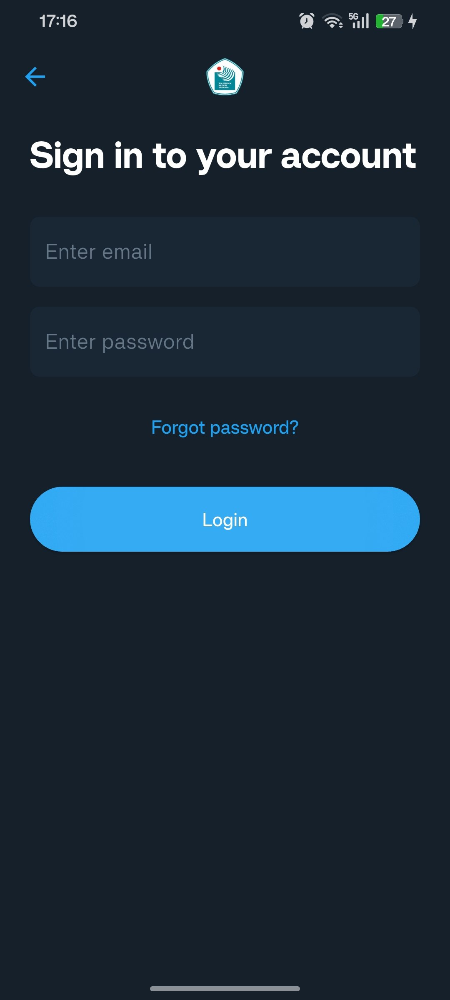 | 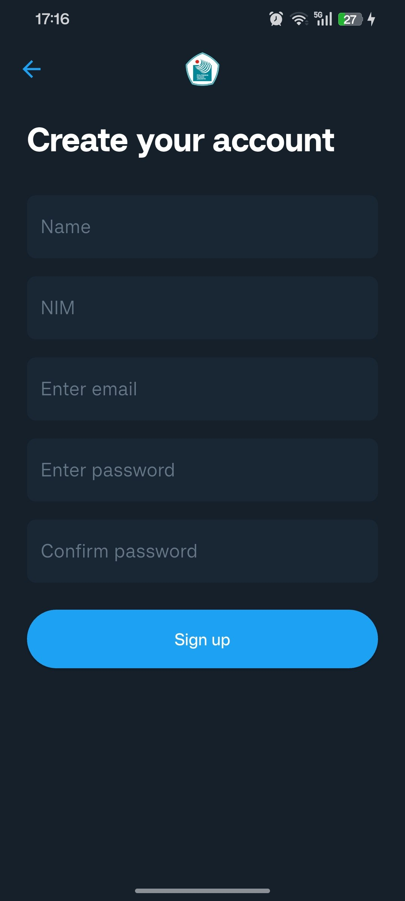 |

### Home & Profile
| Home | Profile | Others Profile |
|------|--------|-----------------|
| 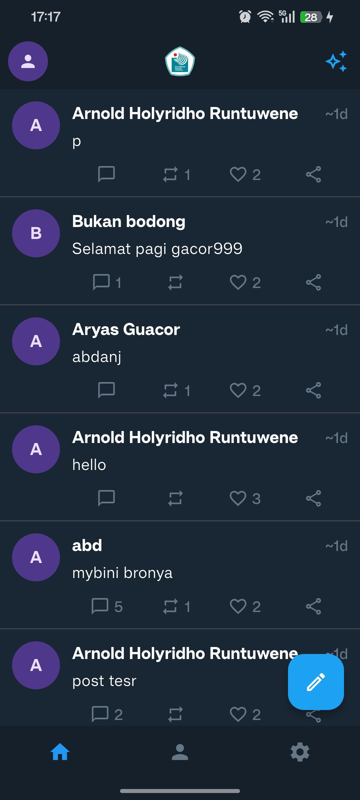 | 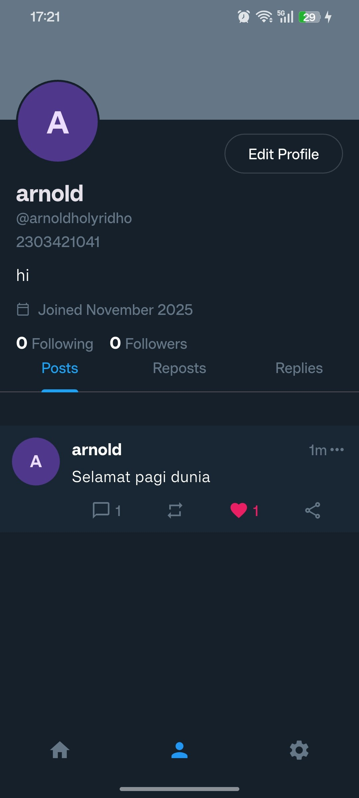 | 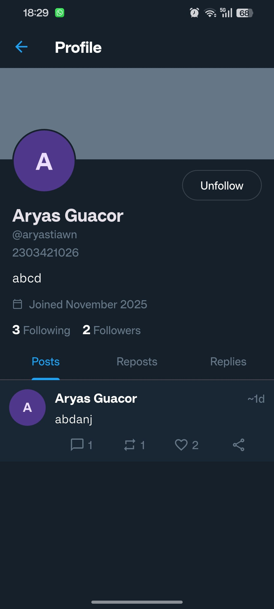 |

### Posting & Interacting
| Post | Reply | Like |
|------|--------|------|
| 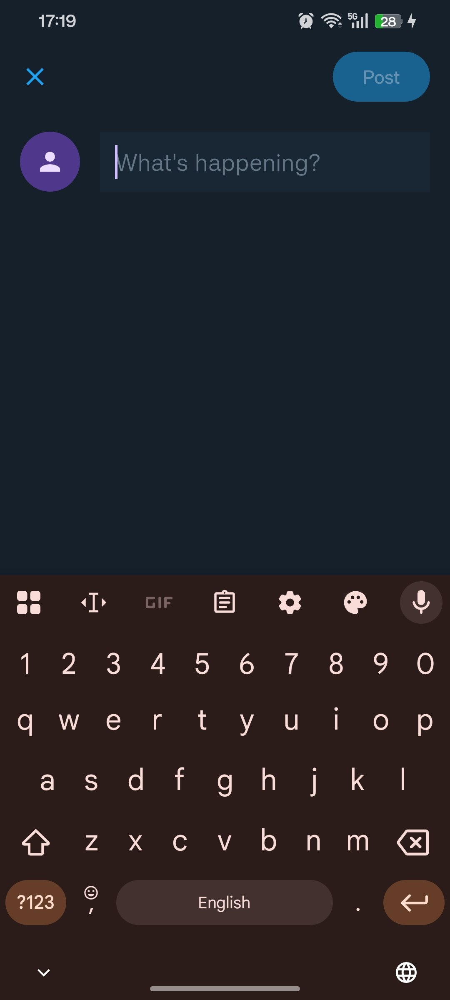 | 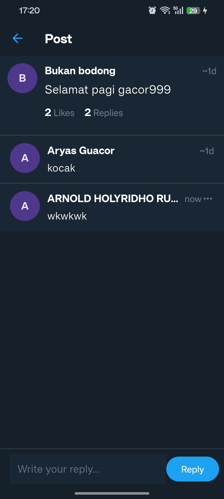 | 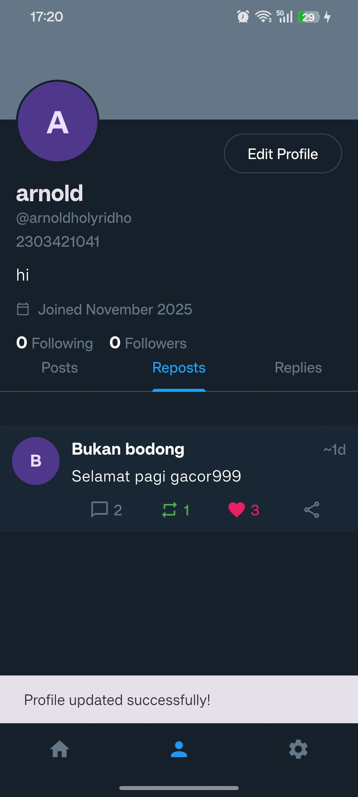 |

### Settings
| Settings | Edit Profile | About |
|----------|--------------|-------|
| 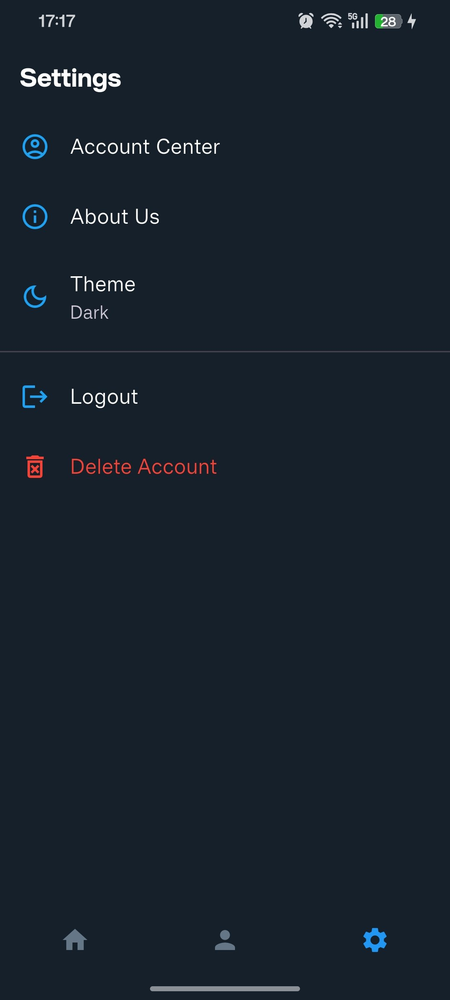 |  | 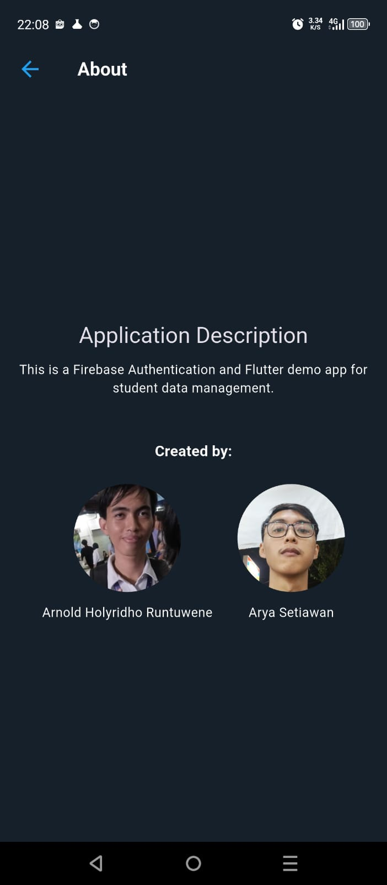 |

---

## Getting Started

Firebase configuration is required before running the application.

---

## 1. Firebase Project Setup

### Create a Firebase Project
- Create a new project in the Firebase Console.

### Add FlutterApp
- Follow the setup guide

### Enable Services
- Authentication → Enable Email/Password  
- Firestore → Create database  

### Firestore Security Rules
```txt
rules_version = '2';
service cloud.firestore {
  match /databases/{database}/documents {
    
    // USERS: Allow user to update their own profile fields
    match /users/{userId} {
      allow read, create: if request.auth.uid != null;
      allow delete: if request.auth.uid == userId;
      
      allow update: if request.auth.uid != null && (
        (request.auth.uid == userId) || // User updates own profile
        (request.auth.uid != userId && 
         request.resource.data.diff(resource.data).affectedKeys().hasOnly(['followers'])) // Other user follows
      );
    }

    // NOTIFICATIONS
    match /users/{userId}/notifications/{notificationId} {
      allow create: if request.auth.uid != null;
      allow read, update, delete: if request.auth.uid == userId;
    }

    // POSTS: Allow updating avatar fields on own posts
    match /posts/{postId} {
      allow read, create: if request.auth != null;
      allow delete: if request.auth.uid == resource.data.userId;

      allow update: if request.auth != null && (
        // Allow updating profile info on old posts
        (request.auth.uid == resource.data.userId && 
         request.resource.data.diff(resource.data).affectedKeys().hasOnly(['text', 'userName', 'avatarIconId', 'avatarHex'])) ||
        
        // Allow updating likes/comments count by others
        (request.resource.data.diff(resource.data).affectedKeys().hasOnly(['likes', 'commentCount', 'repostedBy']))
      );
    }

    // COMMENTS: Allow updating avatar fields on own comments
    match /posts/{postId}/comments/{commentId} {
      allow read, create: if request.auth != null;
      allow delete: if request.auth.uid == resource.data.userId;
      
      allow update: if request.auth.uid == resource.data.userId && (
        request.resource.data.diff(resource.data).affectedKeys().hasOnly(['text', 'userName', 'avatarIconId', 'avatarHex'])
      );
    }
    
    match /{path=**}/comments/{commentId} {
      allow read: if request.auth != null;
    }
  }
}
```
### Firestore Indexes

**Posts Tab (Collection):**

* Collection ID: `posts`
* `userId` Ascending
* `timestamp` Descending

**Replies Tab (Collection Group):**

* Collection ID: `comments`
* `userId` Ascending
* `timestamp` Descending

---

## 2. Local Setup

Clone:

```sh
git clone https://github.com/blankony/myfirebaseflutterapp
```

Install:

```sh
flutter pub get
```

Run:

```sh
flutter run
```

---

## Main Dependencies

* `firebase_core`
* `firebase_auth`
* `cloud_firestore`
* `timeago`

