# Screenshot Gallery

Here is the complete collection of screenshots for **SAPA PNJ**, categorized by feature.

## 1. Authentication & Onboarding
| Welcome Screen | Login | Register |
|---|---|---|
|  |  |  |

## 2. Home Dashboard
| Home Feed | Sidebar Menu | Notifications |
|---|---|---|
|  |  |  |

| PNJ Services | Language & Theme |
|---|---|
| 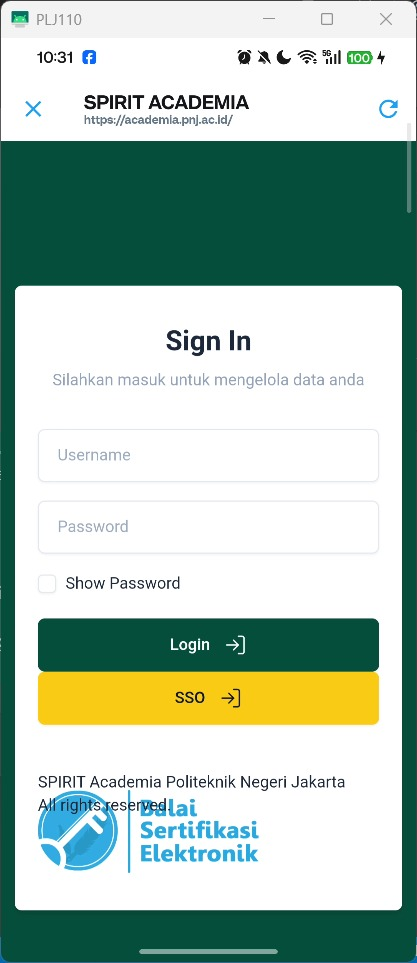 | 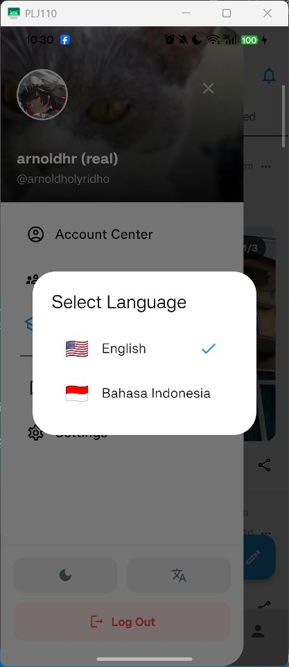 |

## 3. Community Features
### Discovery & Creation
| Community List | Discover | Create Community |
|---|---|---|
|  |  |  |

### Interaction
| Community View | Posts in Community | Select Community (Post) |
|---|---|---|
|  |  | 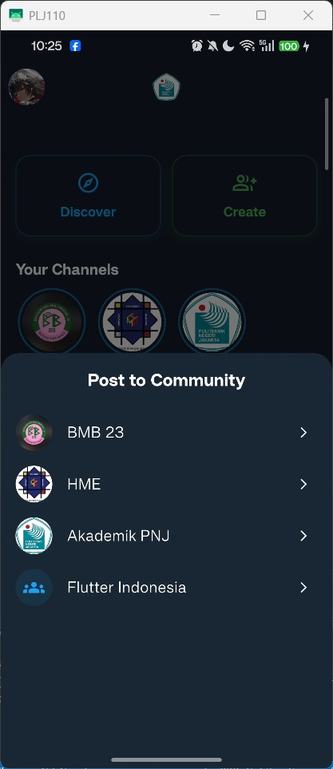 |

### Management & Roles
| Edit Channel | Edit Role Info | Assign Roles | Member Roles |
|---|---|---|---|
| 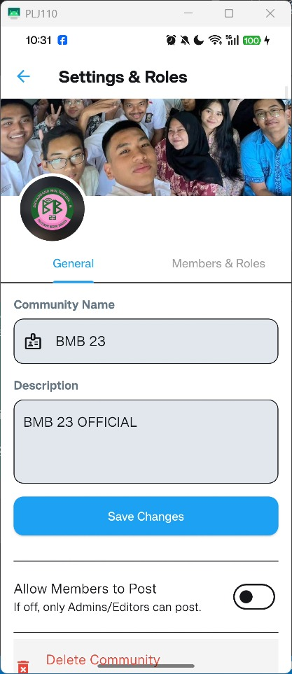 | 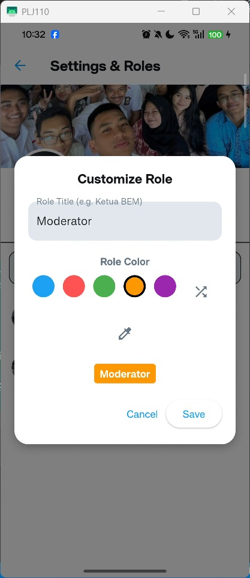 |  | 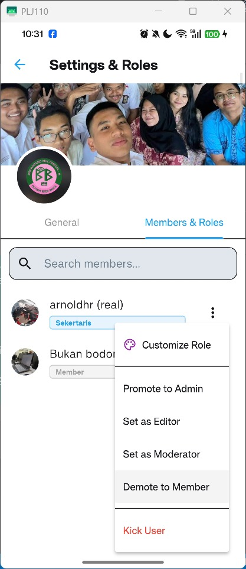 |

## 4. Search System
| Search Main | Discover Tab | Search Users |
|---|---|---|
|  | 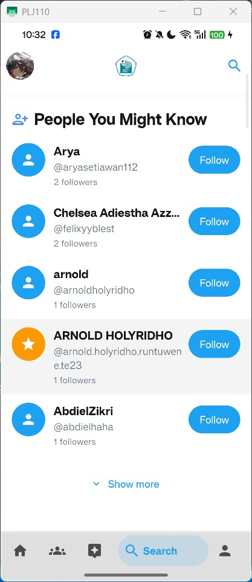 |  |

| Search Communities | Search Posts |
|---|---|
|  | 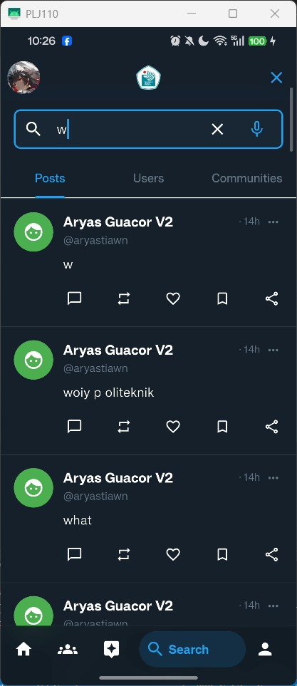 |

## 5. User Profile
### Profile Tabs
| My Posts | Replies | Reposts |
|---|---|---|
|  | 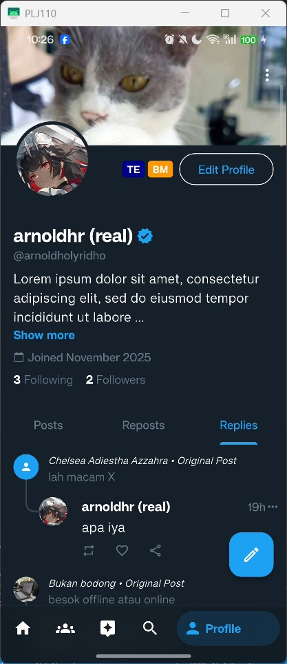 | 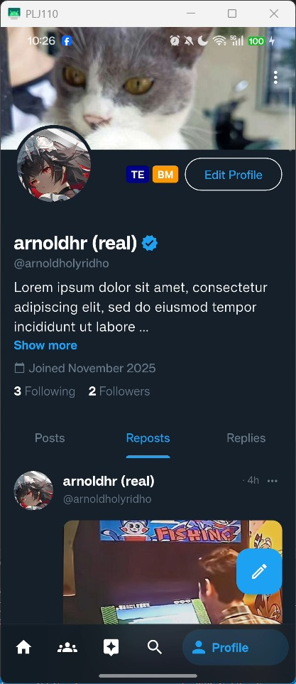 |

### Connections
| Following | Followers | Mutuals |
|---|---|---|
|  |  | 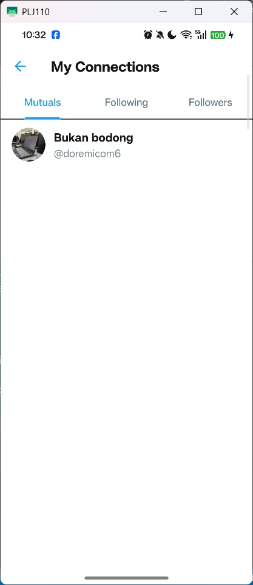 |

### Editing
| Edit Profile | Edit Avatar |
|---|---|
|  | 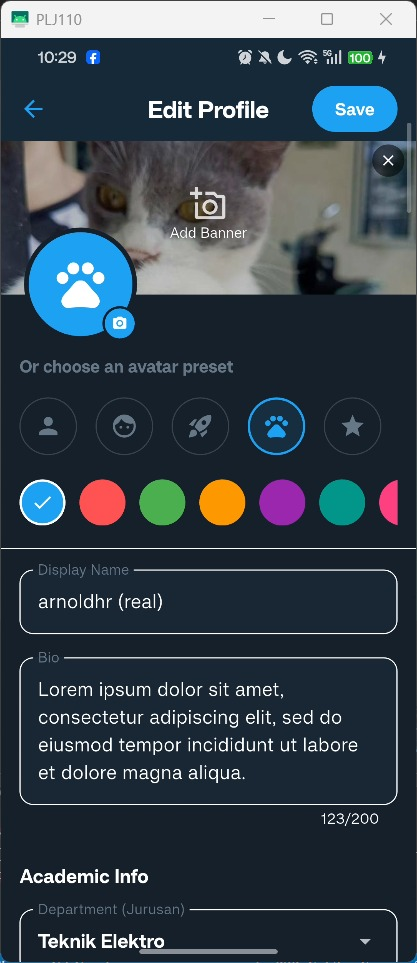 |

## 6. Posts & Interactions
| Create Post | Visibility Settings | Post Replies |
|---|---|---|
|  | 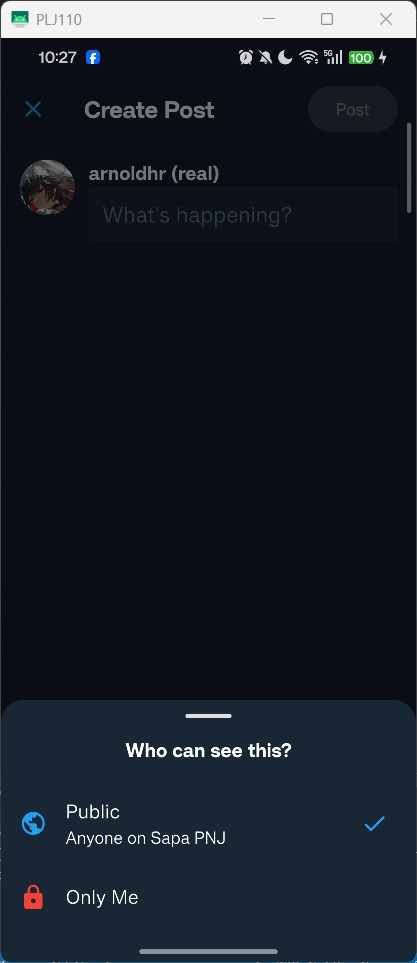 |  |

| Image Uploading | Attached Images | Image Cropper |
|---|---|---|
|  | 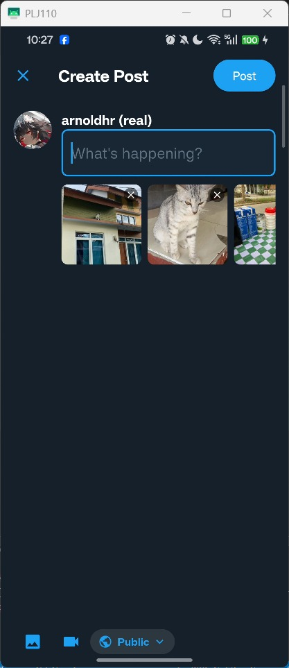 | 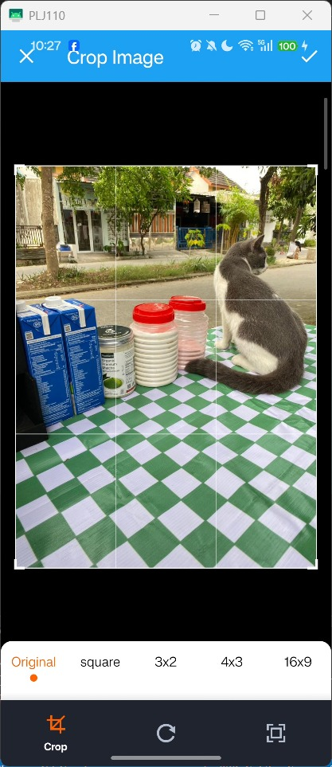 |

## 7. AI Assistant (Spirit AI)
| Chat Interface | Example Prompts | Chat History |
|---|---|---|
|  | 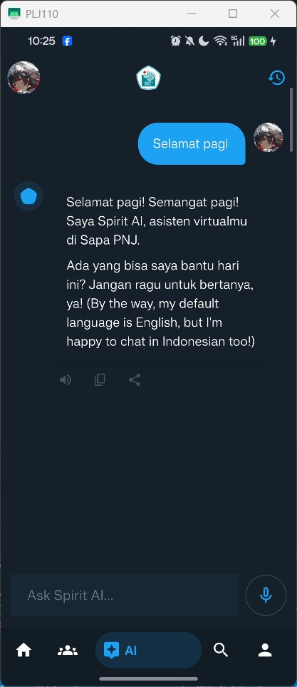 |  |

## 8. Settings
| Main Settings | Account Center | Change Password |
|---|---|---|
|  |  | 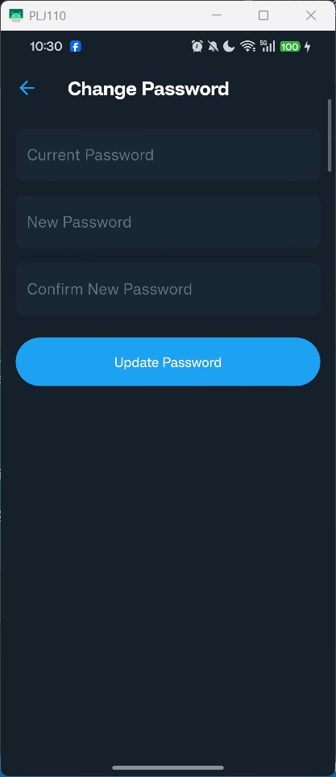 |

| Blocked Users | Language Settings |
|---|---|
| 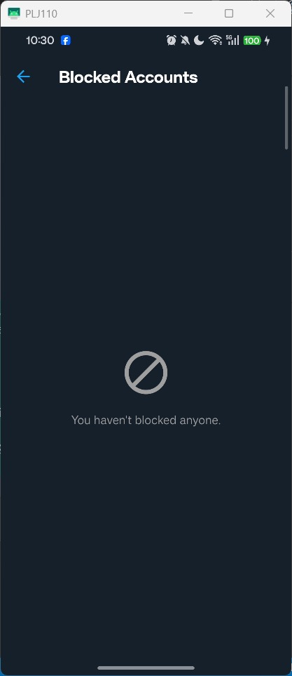 |  |

## 9. About
| About App | About Creator |
|---|---|
| 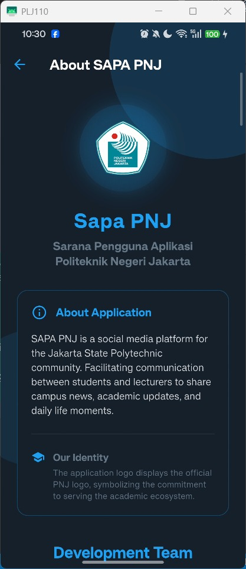 |  |

---
[⬅️ Back to README](README.md)